# 노인 건강 모니터링 시스템

ppt 자료 : https://github.com/agitated-deduction/elderlyCareSystem/blob/master/web/%EC%9E%84%EB%B2%A0%EB%94%94%EB%93%9C%202%EC%A1%B0%20%EB%B0%9C%ED%91%9C%EC%9E%90%EB%A3%8C.pptx

* 홈 디바이스
* 웨어러블 디바이스(스마트 밴드)
* 웹
* 앱

## 전체 개요

보건 복지부의 독거노인 종합 지원 대책에 따르면 고령화 심화, 부모 부양 인식 변화 등으로 독거 노인  규모 가 증가하였다.
독거노인은 부부노인이나 자녀동거노인과 비교하여 건강, 소득, 사회적 측면에서 상대적으로 취약한 편으로 정책적 관심이 필요하다.
정부는 공공 및 민간지원 확대를 통한 일상생활 지원, 안전 관리 등 취약 독거노인에 대한 돌봄 서비스  지속 확대하여 이러한 문제를 해결하고자 하였으나, 돌봄 서비스 확대에도 불구하고 보호 독거 노인 급증,  서비스 거부자의 고독사 발생 등 돌봄 사각지대가 지속적 발생하였다.
때문에 이러한 현상을 해결하고자  정부에서는 '독거 어르신 안전·건강관리 솔루션(IOT)사업'으로 해결을  모색 중이다. 
하지만, 현재 활용되는 시스템에서는 독거노인 기준으로 대상이 한정되어 있고,
집 안에만 기기를 설치하여 외부 활동시에 활동을 파악하지 못하고 긴급상황에
대처할 수 없다는 단점이 있다. 
따라서 이런 단점을 해결하고자 홈 기기, 밴드, 웹, 앱 등의 개별로 활용되는 기술들을 하나의 시스템으로 구축하여 예방 또는 관리의 편의성을 증진하고자 하였으며,
독거노인 뿐만 아닌 기타 보호대상자 (치매,또는 만성 질환자로 실시간 안전확인 필요자)에 대해서 정부 관리자 뿐 만 아닌 보호자도 쉽게 확인 및 관리 가능한 시스템을 개발하고자 했다.

## WEB

#### 개발 환경
Back-end : Apache Tomcat, Java, Spring framework, MySQL
Front-end : html, css, javascript, jquery
프론트엔드는 무료 대시보드 템플릿 사용
https://www.egrappler.com/templatevamp-twitter-bootstrap-admin-template-now-available/

#### 웹 주요 기능
1. 센서 데이터 서버로 수집
2. 데이터 전송 및 웹 페이지로 가시화
3. 로그인, 로그아웃, 회원 관리 기능
4. 간단한 일정 관리 기능

#### 화면 구성

메인 화면
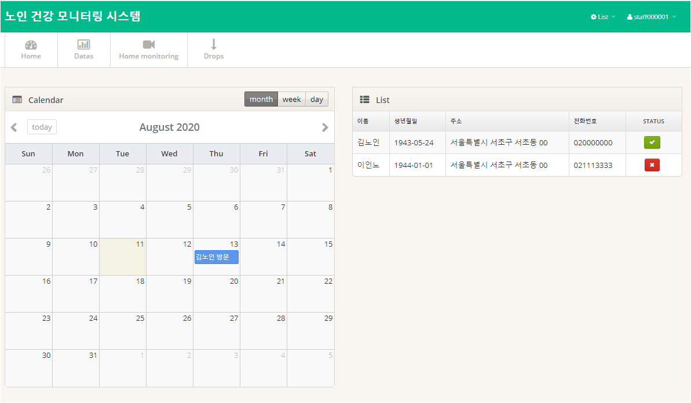

데이터 화면
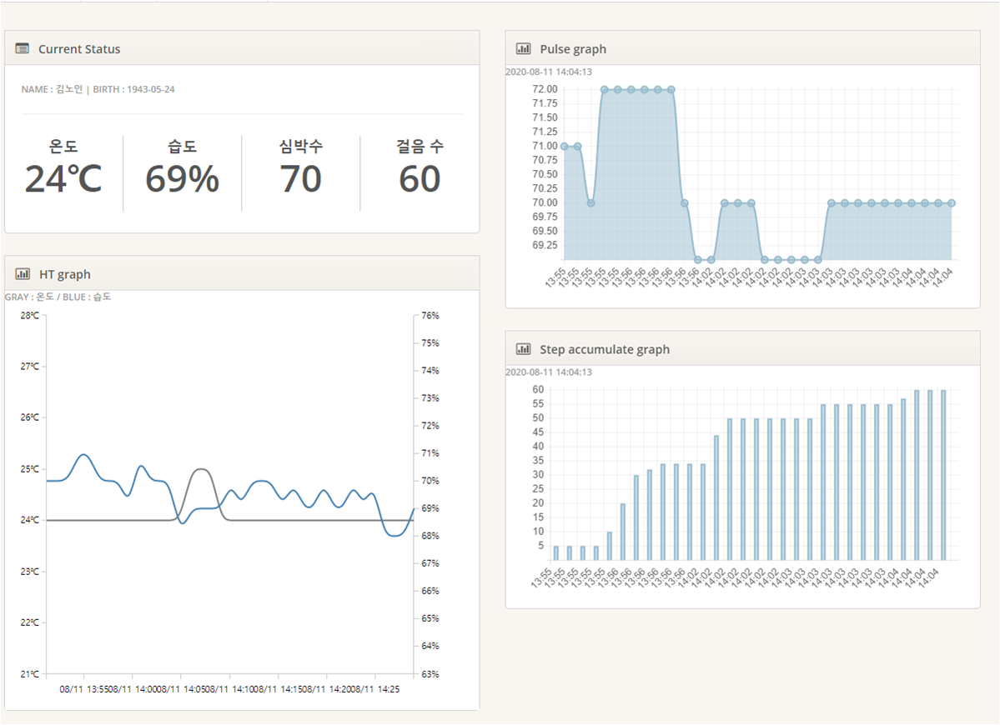

모니터링 화면
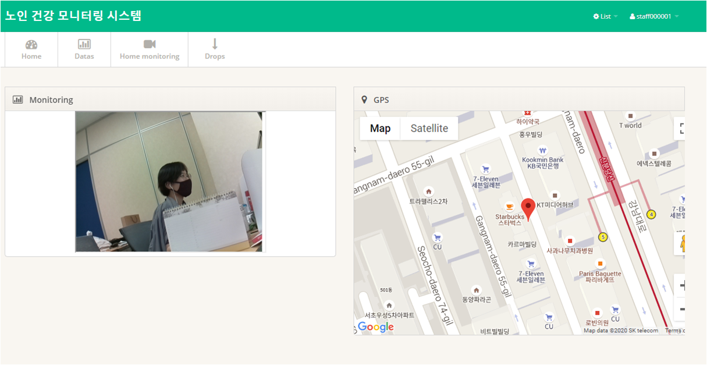

#### DB 구조

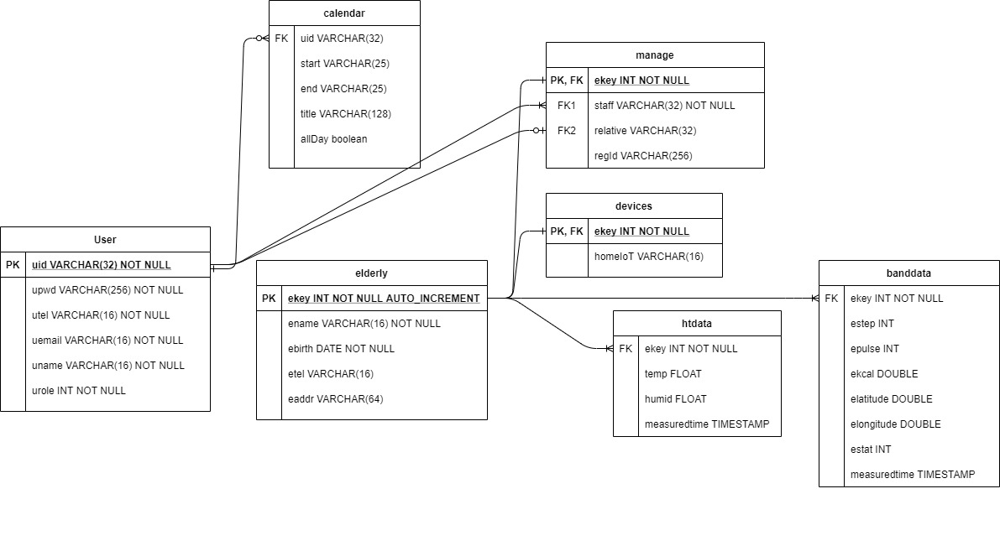
user: 사이트 가입자(보호자) 및 담당 직원
elderly: 는 관리 대상은 나타낸다
센서 데이터는 홈 디바이스로부터 오는 데이터와 밴드로부터 오는 데이터를 구분하였다.

#### 구현 기능

* MQTT를 이용한 통신
	* mqtt는 단순하고 가벼운 메세징 프로토콜이라 IoT환경에서 사용하기 적합하다. 낮은 전력, 낮은 대역폭 환경에서 사용 가능하다.
	* 메세지를 topic으로 발행하고 해당 topic을 구독하는 방식으로 작동한다. broker는 client들의 중개인이 된다.

MqttAsyncClient를 사용해서 통신 과정을 외부 어플리케이션으로 구현하였다.
spring init-method 태그를 사용하여, bean 생성시에 함께 실행되도록 하였다.

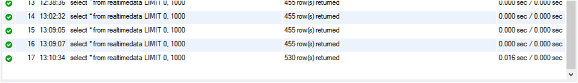
spring프로젝트와의 연결 전에는 잘 작동하였으나 연결 후, 받아온 데이터를 DB insert시에 데이터 값이 버퍼에 쌓여있다가 한번에 들어가는 현상이 발생했다. 이는 data access부분을 async하게 구현하자 해결되었다.

* http post 메소드를 이용해 안드로이드와 통신
웨어러블 스마트 기기로부터 오는 데이터는 안드로이드를 거쳐서 http post 메소드를 이용해 웹 서버에 입력된다. Async controller로 구현했다.

* 로그인 & 로그아웃

로그인 시 비밀번호는 SHA-256 암호화를 한다. 암호화 과정은 다이어그램상 service 단에서 하는 것으로 되어 있으나 controller부분으로 코드 수정 예정이다.

로그인 화면이다.
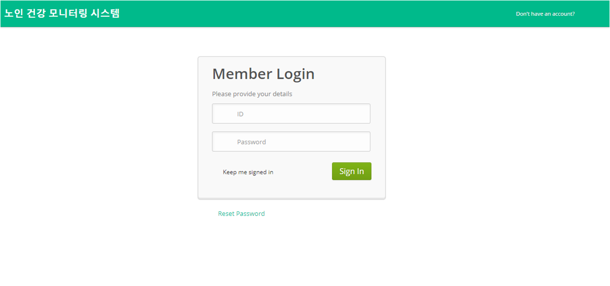

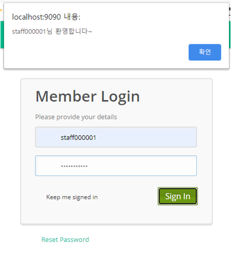
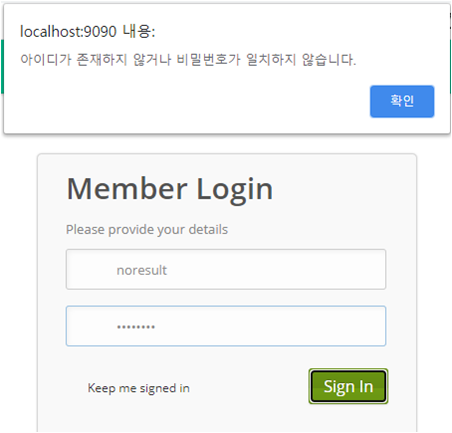
각각 로그인 성공과 실패시 화면이다. 로그인 성공시 홈 화면으로 redirect되고 실패시 로그인 화면에 그대로 남는다.

로그아웃시에는 세션이 만료되고 인터셉터에 의해 자동으로 로그인 화면으로 이동한다.

* 기기등록
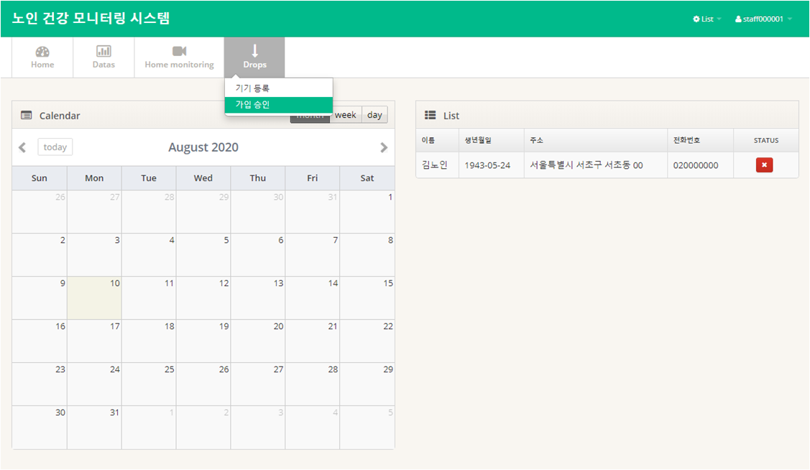
drop버튼을 누르면 부가 기능이 나온다. 기기등록 및 가입 승인이 있다.
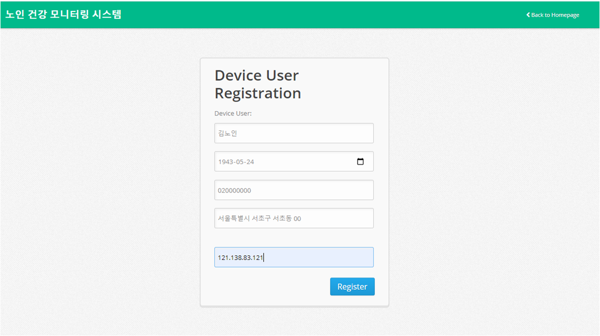
기기등록은 새로운 iot기기를 등록하는 과정이다. 노인 정보, 기기ip 등을 받아 DB에 저장한다.
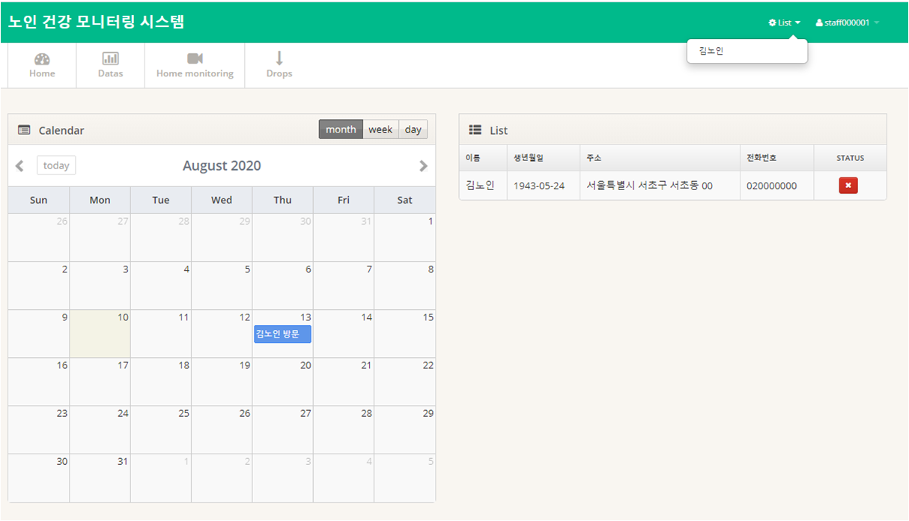
등록 성공시 화면에 추가된다. 현재 상태도 함께 보여준다.

* 회원가입 & 가입승인
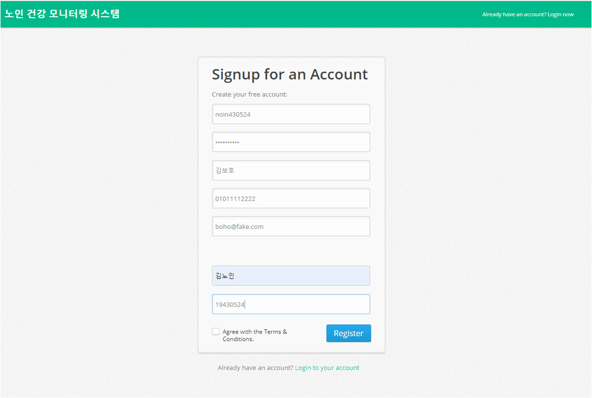
보호자를 위한 기능이다.
보호자는 사전에 서류신청을 했다고 가정하며 보호자가 신청한 대상의 담당 직원이 직접 가입 승인을 해야 데이터를 열람 가능하다.

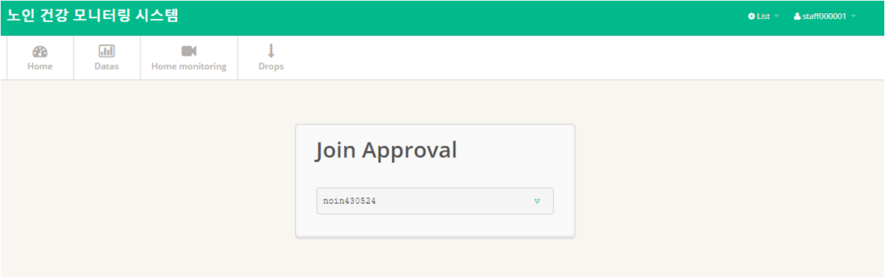
승인 화면이다.

* 일정 관리
무료 대시보드 템플릿에 있는 달력을 활용해서 구현했다.
id마다 각각 본인이 입력한 정보만 저장되며 볼 수 있다. 추후 다른 사람과 공유할 일정과 개인 일정을 설정하여 입력 가능하게 구현 할 예정이다.

일정 입력
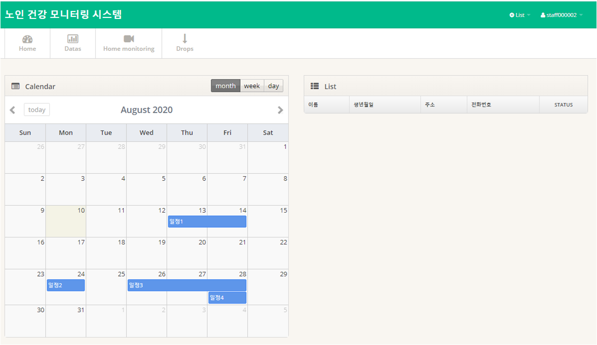
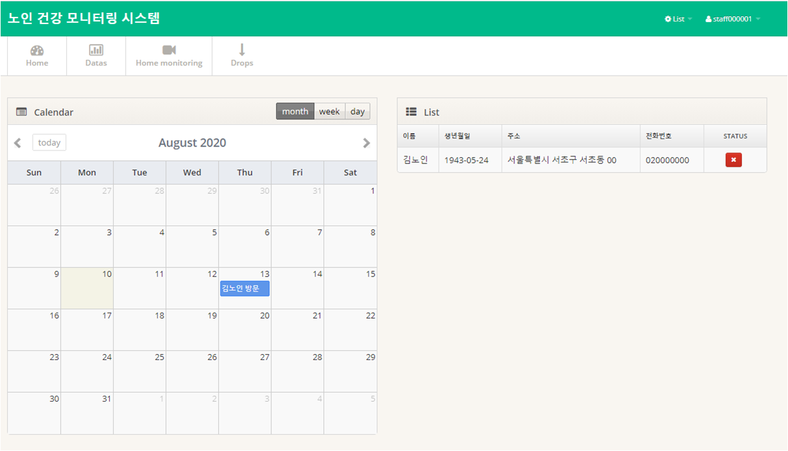
아이디마다 다른 데이터가 저장된 모습

